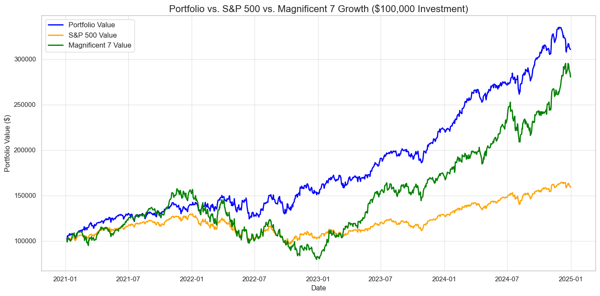

# 🚀Portfolio Optimization and Market Performance Analysis using Python and ML📊


## 📌 Project Overview
Financial markets are highly dynamic, influenced by volatility, macroeconomic trends, and sector rotations. Traditional portfolio allocation approaches often rely on market-cap weighting or sector diversification, which may not capture the optimal risk-return trade-off.

This project leverages **Hierarchical Clustering, Gaussian Mixture Models (GMM), and DBSCAN** to segment stocks based on **return-volatility** profiles. The goal is to construct **risk-adjusted portfolios** that outperform traditional benchmarks such as the **S&P 500** and the **Magnificent 7**. The strategy also incorporates **Sentiment Analysis using the News API** to gauge market sentiment and adjust portfolio selection accordingly. The strategy is then rigorously **backtested** and evaluated across multiple market conditions (2021-2025).

---

## 🔍 Technology Stack
| Component       | Tools Used  |
|---------------|------------|
| **Data Collection** | Yahoo Finance API, Pandas, News API  |
| **Feature Engineering** | NumPy, Scikit-learn, NLP for Sentiment Analysis |
| **Clustering Algorithms** | Hierarchical Clustering, GMM, DBSCAN |
| **Portfolio Optimization** | Mean-Variance Optimization, SciPy |
| **Backtesting** | Custom Python scripts |
| **Visualization** | Matplotlib, Seaborn, Plotly |

---

## 🔬 Methodology

### 1️⃣ Data Collection & Preprocessing
- **Live stock data** from the **S&P 500** was retrieved from [Yahoo Finance](https://finance.yahoo.com/).
- **Returns, volatility, beta, Sharpe ratio, Sortino ratio, max drawdown, and Value-at-Risk (VaR)** were computed for each stock.
- **Sentiment Analysis using News API**: Extracted market sentiment scores from financial news to enhance portfolio selection.
- **Data cleaning**: Missing values were removed, and tickers were adjusted to ensure compatibility with Yahoo Finance.

### 2️⃣ Feature Engineering
- **Daily Returns & Volatility**: Computed using rolling window standard deviations.
- **Beta Calculation**: Stocks were compared to the **S&P 500** benchmark.
- **Sharpe & Sortino Ratios**: Used to measure risk-adjusted returns.
- **Max Drawdown**: Identified worst-case declines in portfolio value.
- **Value-at-Risk (VaR) & Conditional VaR (CVaR)**: Estimated potential losses under extreme market conditions.
- **Sentiment Scores from News**: Incorporated into stock selection to adjust portfolio weighting based on positive or negative market sentiment.

### 3️⃣ Clustering for Stock Selection
- **Hierarchical Clustering** was used to segment stocks based on return-volatility profiles.
- **Gaussian Mixture Models (GMM) and DBSCAN** were applied for robustness in clustering.
- **Dendrogram Analysis** determined the optimal number of clusters.
- **Stocks were selected across multiple clusters** to maximize diversification.

### 4️⃣ Portfolio Optimization
- **Mean-Variance Optimization (MVO)** was applied to determine optimal portfolio weights.
- Single-cluster and **multi-cluster portfolio** selections were tested.
- The **Top 100 stocks** based on Sharpe Ratio and sentiment analysis were chosen for final allocation.

### 5️⃣ Backtesting & Performance Analysis
- **Portfolio returns** were compared to the **S&P 500** and **Magnificent 7**.
- **Investment Growth Analysis**: How $100,000 would grow under each strategy.
- **Rolling Volatility & Maximum Drawdown**: Risk assessments over time.
- **Sector Allocation Analysis**: Portfolio diversity measured using GICS classifications.
- **Performance Comparison for 2022 & 2023**: Evaluating results under bear and bull markets.

---

## 📈 Performance Insights

### 📊 Overall Performance (2021-2025)
| Metric           | Portfolio  | S&P 500  | Magnificent 7 |
|-----------------|-----------|---------|--------------|
| **Annual Return** | 0.75%    | 0.71%  | 0.80%       |
| **Volatility**   | 0.08%    | 0.06%  | 0.12%       |
| **Sharpe Ratio** | 9.59     | 11.53  | 8.20        |
| **Max Drawdown** | -12.5%   | -20.3% | -28.7%      |

### 📊 Performance Comparison for 2022 (Bear Market)
| Metric           | Portfolio  | S&P 500  | Magnificent 7 |
|-----------------|-----------|---------|--------------|
| **Annual Return** | 13.67%    | -17.13% | -40.53%      |
| **Volatility**   | 26.59%    | 24.17%  | 42.38%       |
| **Sharpe Ratio** | 0.44      | -0.79   | -1.00        |
| **Max Drawdown** | -17.19%   | -25.42% | -49.13%      |


### ✅ Key Takeaways
- **Single-Cluster Selection** performed better in this analysis.
- **Multi-Cluster Portfolios** provided diversification but had slightly lower performance.
- **Sentiment Analysis Improved Stock Selection**, ensuring that stocks with positive sentiment had higher weightage.
- **The strategy significantly reduced drawdowns** compared to benchmarks.

---

## 📊 Visual Insights

### 🚀 Cumulative Returns (Portfolio vs. S&P 500 vs. Magnificent 7)



---

## 🔍 Next Steps & Improvements
- **Dynamic Portfolio Rebalancing**: Implement adaptive rebalancing strategies.
- **Deeper Sentiment Analysis**: Incorporate more advanced NLP techniques for news and social media sentiment tracking.
- **Deep Learning Models**: Explore LSTMs for time-series forecasting in portfolio selection.

---

## 🎯 Conclusion
This project successfully implemented a **data-driven clustering approach** for portfolio selection, outperforming traditional benchmarks while minimizing risk. The **single-cluster strategy proved more effective**, particularly in volatile markets. Sentiment analysis further enhanced stock selection by incorporating market sentiment insights.

Happy Coding and Learning🚀
```


